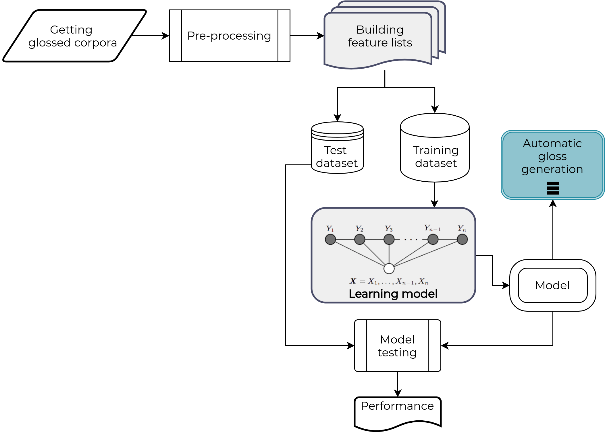

# Automatic gloss generator for Otomí language

## Dependencies

* `python-crfsuite`

### Instalation

* `$ !pip install python-crfsuite`

## Notebooks

Experiments are available inside the `notebooks/` folder and have next names:

* [linearCRF](https://github.com/umoqnier/otomi-morph-segmenter/blob/master/notebooks/linearCRF.ipynb): This setting considers all the information available, i.e., the features that we mentioned above.
* [POSLess](https://github.com/umoqnier/otomi-morph-segmenter/blob/master/notebooks/POSLess.ipynb): In this setting we excluded the POS tags.
* [HMMLike](https://github.com/umoqnier/otomi-morph-segmenter/blob/master/notebooks/HMMLike.ipynb): This setting takes into account the minimum information, i.e. information about the current letter and the immediately preceding one. We use this name because this configuration contains similar information as the HMMs but using CRFs to build them.

### Baseline: HMMLike

* L1 = 0.0 
* L2 = 0.0
* Max de iterions = 50
* model name: `HMMLike_baseline_k_[1-3].crfsuite`

## Preprocessing

### Corpus depuration

* Delete duplicated lines 
    * `$ sort -u corpus > corpus_uniq`
* Show duplicated lines 
    * `$ diff --color corpus_sort corpus_uniq`

## Conventions

### Character substitutions

To solve encoding/decogding problems with `python-crfsuite` we substitute next otomí characters:

* u̱ -> μ
* a̱̱ -> α
* e̱ -> ε
* i̱ -> ι

## Pipeline

1. Obtención del copus glosado
2. Preprocesamiento del texto
3. Creación de las *feature functions*
4. Separación en conjunto de entrenamiento y pruebas
5. Fase de entrenamiento y construcción del modelo
6. Generación de etiquetas y pruebas de rendimiento
